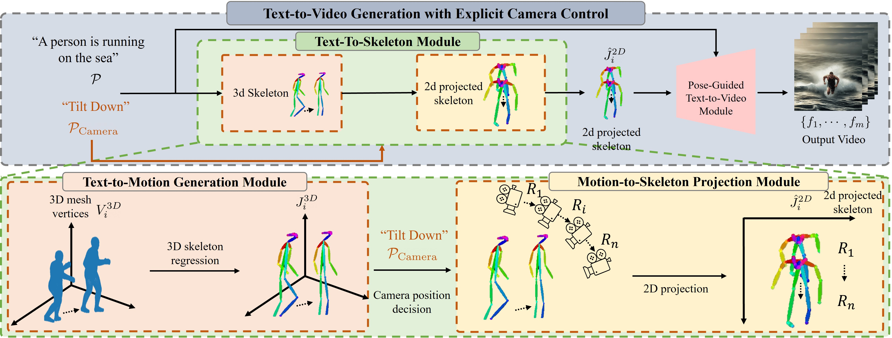

# Pytorch Implementation of paper "Human Motion Aware Text-to-Video Generation with Explicit Camera Control" (WACV 2024)


Our Project Page would be available soon.




## Installation

### Environment
Our code was tested on CUDA 11.7, python3.8.
You can run this code with a single RTX 3090-24G

Using `environment.yml`,
```
conda env create -f environment.yml
conda activate hmtv
```
or you can maunally create conda environment and use `requirements.txt` as below

```
conda create -n hmtv python=3.8 -y
conda activate hmtv
pip install -r requirements.txt
```

If you have trouble with `clip`, you can install with these scripts below

```
pip install ftfy regex tqdm

pip install git+https://github.com/openai/CLIP.git 
```


## Demo
Demo is available in `demo.ipynb`
Before running demo you should run the script below.
```
bash prepare_t2v.sh  
```

This script provides T2M model and one of the T2V model in the paper.

After that you should download pretrained models, checkpoints and other things to run inference code for T2M model.

The details are provided in this [link](https://github.com/Mael-zys/T2M-GPT).

This script clone T2V-Zero and prepare the environment.

If you want to try another T2V models run `clean_t2v.sh` before cloning them.
